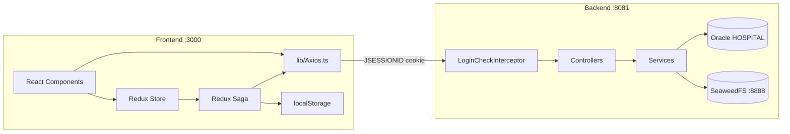

# 00. 공통 인프라

모든 기능이 공유하는 프론트·백엔드 기반 구조입니다. 다른 문서를 읽기 전에 먼저 이해하세요.

**문서 순서:** **00 공통** · [01 로그인](./01-login.md) · [02 세션](./02-session-check.md) · [03 로그아웃](./03-logout.md) · [04 홈](./04-home.md) · [05 사이드바](./05-sidebar.md) · [06 목록](./06-staff-list.md) · [07 상세](./07-staff-detail.md) · [08 삭제](./08-staff-delete.md) · [09 등록](./09-staff-register.md) · [10 사진](./10-photo-upload.md) · [11 주소](./11-address-search.md) · [목록](./README.md)

---

## 1. 앱 진입 구조 (Next.js App Router)

```
app/layout.tsx
  └── Providers.tsx          ← Redux Provider
        └── AppShell.tsx     ← 사이드바 + main + LoginModal + fetchMe
              └── {children} ← 각 page.tsx
```

| 파일 | 역할 |
|------|------|
| `app/layout.tsx` | 전 페이지 공통 HTML/body, Providers + AppShell 감싸기 |
| `app/Providers.tsx` | `react-redux` `<Provider store={store}>` |
| `components/layout/AppShell.tsx` | 좌측 Sidebar, 우측 main, 전역 LoginModal, 마운트 시 세션 확인 |

---

## 2. HTTP 클라이언트 — `lib/Axios.ts`

```typescript
export const api = axios.create({
  baseURL: process.env.NEXT_PUBLIC_API_URL || "http://localhost:8081",
  withCredentials: true,  // JSESSIONID 쿠키 자동 전송
});
```

- **실제 인증 수단**: 백엔드 `HttpSession` + 브라우저 `JSESSIONID` 쿠키
- `withCredentials: true` → cross-origin(3000↔8081) 요청에도 쿠키 포함
- 백엔드 CORS: `allowCredentials: true`, origin `http://localhost:3000`

---

## 3. 공통 API 응답 타입 — `lib/types/apiResponse.ts`

```typescript
type ApiResponse<T> = {
  code: string;    // "SUCCESS" | "UNAUTHORIZED" | "AUTH_FAILED" ...
  message: string; // "OK" | 에러 메시지
  data: T;         // 성공 시 payload, 실패 시 null
};
```

프론트와 백엔드 모두 이 형식을 사용합니다 (사진 바이너리 API 제외).

---

## 4. Redux Store — `store/Store.ts`

| reducer key | slice 파일 | 담당 |
|-------------|-----------|------|
| `auth` | `features/auth/slice/authSlice.ts` | 로그인, 세션, 모달 |
| `sidebar` | `features/sidebar/slice/sidebarSlice.ts` | 메뉴 트리 |
| `staff` | `features/staff/slice/staffSlice.ts` | 목록, 삭제 |

Saga 진입점: `store/RootSaga.ts` → `watchAuthSaga`, `watchSidebarSaga`, `watchStaffSaga`

### Redux 사용 vs 직접 API 호출

| 기능 | Redux Saga | 직접 API |
|------|-----------|---------|
| 로그인, 세션, 로그아웃 | ✅ | — |
| 사이드바 | ✅ | — |
| 직원 목록, 삭제 | ✅ | — |
| 직원 상세 조회 | slice 필드 있으나 **미사용** | ✅ `StaffDetail.tsx` |
| 직원 등록 | slice 필드 있으나 **미사용** | ✅ `StaffRegister.tsx` |

---

## 5. localStorage — `features/auth/utils/authStorage.ts`

| 항목 | 값 |
|------|-----|
| 키 | `"hospital_auth_user"` |
| 저장 내용 | `AuthUser` JSON `{ staffId, name, staffRoleCode }` |
| 저장 시점 | 로그인 성공, fetchMe 성공 |
| 삭제 시점 | fetchMe 실패, 로그아웃 |

**중요**: localStorage는 **UI 표시용 캐시**입니다. 실제 인증 판별은 항상 `JSESSIONID` 쿠키 + `GET /api/auth/me`입니다.  
`loadAuthUser()` 함수는 정의되어 있지만 **현재 어디에서도 호출하지 않습니다.**

---

## 6. 인증 가드 — `RequireAuth.tsx`

보호 페이지(`/staff`, `/staff/register`, `/staff/[id]`)에서 사용:

```
sessionChecked === false  →  "로그인 확인 중..." 표시
sessionChecked === true && user === null  →  LoginModal 열기 + "로그인이 필요합니다."
sessionChecked === true && user !== null  →  children 렌더
```

---

## 7. 백엔드 인증 인프라

### 7-1. LoginCheckInterceptor

- 적용 경로: `/api/**`
- 세션 키: `"LOGIN_USER"` → 값 타입 `AuthUserDto`
- **인터셉터 제외 (공개)**:
  - `POST /api/auth/login`
  - `GET /api/auth/me`
  - `POST /api/auth/logout`
  - `GET /api/sidebar`
- 세션 없이 보호 API 호출 → HTTP **401**:
  ```json
  { "code": "UNAUTHORIZED", "message": "로그인이 필요합니다.", "data": null }
  ```

### 7-2. AuthExceptionHandler

- `IllegalArgumentException` → HTTP **400**, `code: "AUTH_FAILED"`

### 7-3. 역할 기반 권한

없음. 로그인만 되어 있으면 모든 `/api/staff/**` 접근 가능.

---

## 8. DB 테이블 요약 (백엔드)

### HOSPITAL.STAFF

| DB 컬럼 | Java 필드 | API 노출 |
|---------|----------|---------|
| STAFF_ID | id | ✅ id / staffNo |
| STAFF_PASSWORD | password | 로그인 입력만, 응답 안 함 |
| STAFF_NAME | name | ✅ |
| STAFF_TYPE | staffType | ✅ (DOC/NUR/ADM) |
| STAFF_ROLE_CODE | staffRoleCode | ✅ (로그인 응답) |
| STAFF_DEPARTMENT_ID | department (FK) | ✅ departmentName |
| STAFF_RANK_CODE | staffRankCode | ✅ |
| STAFF_POSITION_CODE | staffPositionCode | ✅ |
| STAFF_PHONE | staffPhone | ✅ |
| STAFF_EXTENSION_NO | staffExtensionNo | ✅ |
| STAFF_EMAIL | email | ✅ |
| STAFF_HIRE_DATE | hireDate | ✅ |
| STAFF_STATUS | staffStatus | ✅ (로그인 시 "재직"만 허용) |
| STAFF_BIRTH_DATE | birthDate | ✅ |
| STAFF_ADDRESS | address | ✅ |
| STAFF_PHOTO_KEY | staffPhotoKey | DB만, DTO 직접 노출 안 함 → photoUrl로 대체 |

### HOSPITAL.STAFF_DEPARTMENT

| DB 컬럼 | API 필드 |
|---------|---------|
| DEPARTMENT_ID | departmentId |
| DEPARTMENT_NAME | departmentName |

### HOSPITAL.AUTH_MENU (MyBatis)

| DB 컬럼 | API 필드 |
|---------|---------|
| MENU_ID | id |
| PARENT_ID | parentId |
| NAME | label |
| PATH | path |

---

## 9. SeaweedFS (사진 저장)

- 백엔드 `SeaweedFsService`가 업로드/다운로드/삭제 처리
- DB `STAFF_PHOTO_KEY`에 객체 키 저장 (예: `staff/E001.jpg`)
- 목록 API: `photoUrl = "/api/staff/{id}/photo"` (키가 있을 때만)
- 사진 조회: `GET /api/staff/{id}/photo` → 바이너리 + Content-Type (ApiResponse 아님)

---

## 10. 전체 아키텍처 다이어그램


