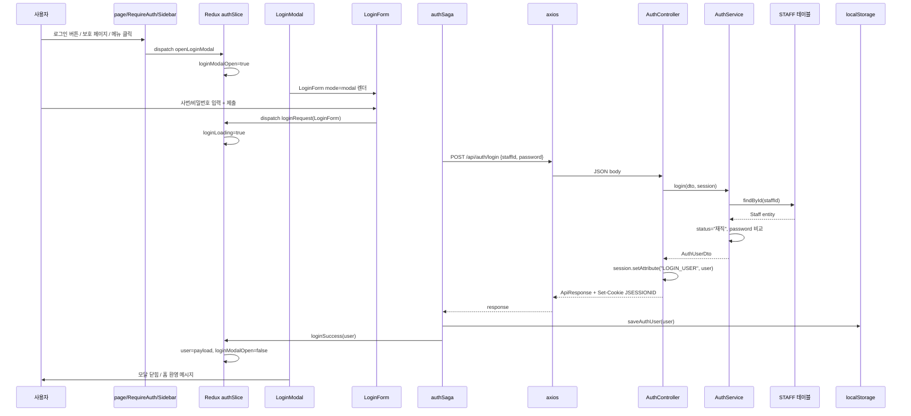

# 01. 로그인

사번·비밀번호로 백엔드 HttpSession을 생성하고, Redux + localStorage에 사용자 정보를 저장하는 흐름입니다.

**문서 순서:** [00 공통](./00-common-infrastructure.md) · **01 로그인** · [02 세션](./02-session-check.md) · [03 로그아웃](./03-logout.md) · [04 홈](./04-home.md) · [05 사이드바](./05-sidebar.md) · [06 목록](./06-staff-list.md) · [07 상세](./07-staff-detail.md) · [08 삭제](./08-staff-delete.md) · [09 등록](./09-staff-register.md) · [10 사진](./10-photo-upload.md) · [11 주소](./11-address-search.md) · [목록](./README.md)

---

## 관련 파일

### Frontend (UI 흐름 순)

| 파일 | 역할 |
|------|------|
| `components/layout/AppShell.tsx` | 전역 `LoginModal` 마운트 |
| `app/page.tsx` | 홈 "로그인" 버튼 → `openLoginModal` |
| `components/auth/RequireAuth.tsx` | 보호 페이지 접근 시 `openLoginModal` |
| `components/sidebar/SidebarMenuItem.tsx` | 미로그인 메뉴 클릭 시 `openLoginModal` |
| `features/auth/slice/authSlice.ts` | `openLoginModal`, `loginRequest` 등 auth 상태·액션 |
| `components/auth/LoginModal.tsx` | 모달 오버레이, `LoginForm mode="modal"` |
| `components/auth/LoginForm.tsx` | 로그인 폼 UI, `loginRequest` 디스패치 |
| `features/auth/saga/authSaga.ts` | `loginSaga` |
| `features/auth/api/authApi.ts` | `loginApi` |
| `features/auth/utils/authStorage.ts` | `saveAuthUser` |
| `features/auth/types/authTypes.ts` | `LoginForm`, `AuthUser` |

### Backend

| 파일 | 역할 |
|------|------|
| `AuthController.java` | `POST /api/auth/login` |
| `AuthService.java` | 사번·비밀번호 검증, AuthUserDto 생성 |
| `StaffRepository` | STAFF 테이블 조회 |
| `LoginCheckInterceptor` | `/api/auth/login`은 인증 제외 |

---

## 데이터 구조

### 프론트 — 폼 입력 (`LoginForm`)

| 필드 | 타입 | 설명 |
|------|------|------|
| `staffId` | `string` | 사번 (제출 시 trim) |
| `password` | `string` | 비밀번호 |

### 프론트 — Redux `auth` 상태 (로그인 관련)

| 필드 | 타입 | 설명 |
|------|------|------|
| `user` | `AuthUser \| null` | 로그인 사용자 |
| `loginLoading` | `boolean` | 요청 중 |
| `loginError` | `string \| null` | 에러 메시지 |
| `loginModalOpen` | `boolean` | 모달 표시 여부 |
| `loginModalMessage` | `string \| null` | 모달 제목 메시지 |

### 프론트/백엔드 공통 — `AuthUser` (로그인 성공 data)

| 필드 | 타입 | DB 출처 |
|------|------|---------|
| `staffId` | `string` | STAFF_ID |
| `name` | `string` | STAFF_NAME |
| `staffRoleCode` | `string` | STAFF_ROLE_CODE |

### 백엔드 — `LoginRequestDto` (요청 body)

| 필드 | 타입 |
|------|------|
| `staffId` | `String` |
| `password` | `String` |

---

## 전체 흐름 (Sequence)

UI에서 모달이 열리는 구간 → 폼 제출 → API → 성공 처리 순입니다.



---

## 단계별 상세

**UI 흐름 기준** — 코드 탭도 이 순서로 열면 됩니다.

```
AppShell → (트리거 3곳) → openLoginModal → LoginModal → LoginForm
  → loginRequest → Saga → API → 백엔드 → loginSuccess
```

### Step 1 — AppShell: LoginModal 전역 마운트 (`AppShell.tsx`)

- `layout.tsx` → `Providers` → `AppShell` → `{children}` 구조
- `AppShell`이 `<LoginModal />`을 **항상** 렌더 (처음엔 `loginModalOpen=false`라 보이지 않음)
- 마운트 시 `fetchMeRequest()`는 **세션 확인**용 ([02-session-check.md](./02-session-check.md)) — 로그인 UI와는 별개

### Step 2 — LoginModal을 여는 트리거 (3곳)

| # | 트리거 | 파일 | 코드 |
|---|--------|------|------|
| ① | 홈 "로그인" 버튼 | `app/page.tsx` | `dispatch(openLoginModal({ message: "로그인이 필요합니다." }))` |
| ② | 보호 페이지 접근 (`/staff` 등) | `RequireAuth.tsx` | `sessionChecked && !user` → `openLoginModal` |
| ③ | 사이드바 메뉴 클릭 (미로그인) | `SidebarMenuItem.tsx` | `handleLinkClick` → `preventDefault` + `openLoginModal` |

공통: 아직 API 호출 없음. Redux `openLoginModal`만 디스패치.

### Step 3 — Redux: 모달 열기 (`authSlice`)

```typescript
openLoginModal(state, action: PayloadAction<{ message?: string } | undefined>) {
  state.loginModalOpen = true;
  state.loginModalMessage = action.payload?.message ?? "로그인이 필요합니다.";
  state.loginError = null;
}
```

### Step 4 — LoginModal 렌더 (`LoginModal.tsx`)

- `loginModalOpen === true`일 때만 DOM에 표시
- 내부에서 `<LoginForm mode="modal" message={loginModalMessage} />` 렌더
- 배경 클릭 / × 버튼 → `closeLoginModal`

### Step 5 — 폼 입력·제출 (`LoginForm.tsx`) ← API 요청 시작점

- 로컬 state: `staffId`, `password`
- `handleSubmit` → `dispatch(loginRequest({ staffId: staffId.trim(), password }))`
- `mode="modal"`: LoginModal 내부 (실사용)
- `mode="page"`: 독립 페이지 (현재 `/login`은 redirect만 함)

### Step 6 — Redux: 로그인 요청 (`authSlice`)

```typescript
loginRequest(state, action: PayloadAction<LoginForm>) {
  state.loginLoading = true;
  state.loginError = null;
}
```

### Step 7 — Saga (`loginSaga`)

```
loginRequest → call(loginApi, payload)
  → saveAuthUser(user)        // localStorage
  → put(loginSuccess(user))
catch → put(loginFailure(message))
```

### Step 8 — API (`loginApi`)

```
POST /api/auth/login
Content-Type: application/json
Body: { "staffId": "E001", "password": "1234" }
withCredentials: true
```

**성공 응답 예시:**

```json
{
  "code": "SUCCESS",
  "message": "OK",
  "data": {
    "staffId": "E001",
    "name": "홍길동",
    "staffRoleCode": "ROLE_ADMIN"
  }
}
```

`unwrapAuthUser()`: `code !== "SUCCESS"` 또는 `data` 없으면 throw

### Step 9 — 백엔드 Controller (`AuthController`)

1. `AuthService.login(LoginRequestDto)` 호출
2. 반환된 `AuthUserDto`를 `session.setAttribute("LOGIN_USER", user)` 저장
3. `ApiResponse.success(user)` 반환
4. Spring이 `JSESSIONID` 쿠키 Set-Cookie

### Step 10 — 백엔드 Service (`AuthService.login`)

| 검증 | 실패 시 |
|------|---------|
| staffId, password 빈값 | 400 `"사번과 비밀번호를 입력하세요."` |
| STAFF_ID 미존재 | 400 `"사번 또는 비밀번호가 올바르지 않습니다."` |
| staffStatus ≠ "재직" | 400 동일 메시지 |
| password 불일치 (평문 비교) | 400 동일 메시지 |

성공 시 `AuthUserDto(staff.id, staff.name, staff.staffRoleCode)` 반환

### Step 11 — Redux 성공 처리

```typescript
loginSuccess(state, action: PayloadAction<AuthUser>) {
  state.user = action.payload;
  state.loginLoading = false;
  state.sessionChecked = true;
  state.loginModalOpen = false;
  state.loginError = null;
}
```

→ `LoginModal`이 `loginModalOpen=false`로 언마운트되어 모달 닫힘

---

## 에러 처리

| 상황 | HTTP | 프론트 표시 |
|------|------|------------|
| 빈 입력 / 잘못된 사번·비밀번호 | 400 | `loginError` = 서버 message |
| 네트워크 오류 | — | `loginError` = "로그인에 실패했습니다." |

---

## 설명 포인트 (면접/발표용)

1. **UI 시작점**은 `LoginForm`이 아니라 `openLoginModal` 트리거 3곳 — 홈 버튼 / `RequireAuth` / `SidebarMenuItem`
2. **API 시작점**은 `LoginForm` `handleSubmit` → `loginRequest` 디스패치
3. **인증 주체는 HttpSession 쿠키**이지, Redux/localStorage가 아님
4. 로그인 UI는 **전용 페이지가 아니라 모달** (`/login` → `/` redirect)
5. 로그인 성공 시 **3곳**에 사용자 정보 반영: HttpSession, Redux `auth.user`, localStorage
6. 백엔드는 **평문 비밀번호** 비교 (학습용 프로젝트)
