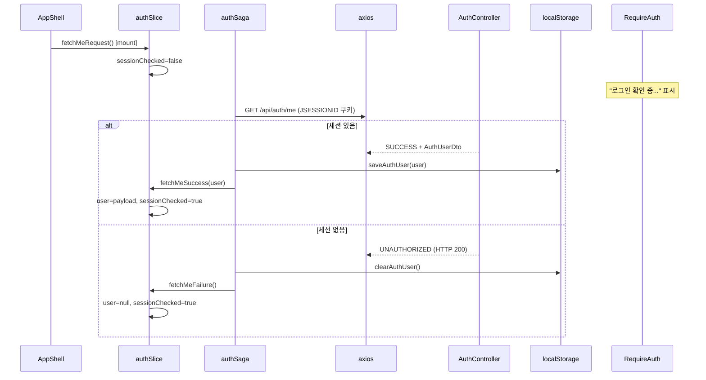

# 02. 세션 확인 (fetchMe)

앱 최초 로드 시 현재 HttpSession이 유효한지 확인하고, Redux `user` 상태를 채우는 흐름입니다.  
**모든 페이지의 인증 판별 기준**이 됩니다.

**문서 순서:** [00 공통](./00-common-infrastructure.md) · [01 로그인](./01-login.md) · **02 세션** · [03 로그아웃](./03-logout.md) · [04 홈](./04-home.md) · [05 사이드바](./05-sidebar.md) · [06 목록](./06-staff-list.md) · [07 상세](./07-staff-detail.md) · [08 삭제](./08-staff-delete.md) · [09 등록](./09-staff-register.md) · [10 사진](./10-photo-upload.md) · [11 주소](./11-address-search.md) · [목록](./README.md)

---

## 관련 파일

### Frontend

| 파일 | 역할 |
|------|------|
| `components/layout/AppShell.tsx` | 마운트 시 `fetchMeRequest()` 디스패치 |
| `components/auth/RequireAuth.tsx` | `sessionChecked`, `user`로 렌더 분기 |
| `features/auth/slice/authSlice.ts` | `fetchMeRequest/Success/Failure` |
| `features/auth/saga/authSaga.ts` | `fetchMeSaga` |
| `features/auth/api/authApi.ts` | `fetchMeApi` |
| `features/auth/utils/authStorage.ts` | 성공 시 save, 실패 시 clear |

### Backend

| 파일 | 역할 |
|------|------|
| `AuthController.java` | `GET /api/auth/me` |
| `LoginCheckInterceptor` | 이 경로는 인터셉터 **제외** (컨트롤러에서 직접 판별) |

---

## 데이터 구조

### Redux `auth` 상태 (세션 관련)

| 필드 | 타입 | 설명 |
|------|------|------|
| `user` | `AuthUser \| null` | 세션 유효 시 사용자, 아니면 null |
| `sessionChecked` | `boolean` | fetchMe 완료 여부 (false = 확인 중) |

### 응답 data — `AuthUser` (로그인과 동일)

| 필드 | 타입 |
|------|------|
| `staffId` | `string` |
| `name` | `string` |
| `staffRoleCode` | `string` |

---

## 전체 흐름



---

## 단계별 상세

### Step 1 — AppShell 마운트

```typescript
useEffect(() => {
  dispatch(fetchMeRequest());
}, [dispatch]);
```

`layout.tsx` → `AppShell`이 모든 페이지에서 1회 실행됩니다.

### Step 2 — Redux

```typescript
fetchMeRequest(state) {
  state.sessionChecked = false;  // 확인 중
}
```

### Step 3 — API

```
GET /api/auth/me
Cookie: JSESSIONID=...
withCredentials: true
```

**로그인 상태 응답:**

```json
{
  "code": "SUCCESS",
  "message": "OK",
  "data": {
    "staffId": "E001",
    "name": "홍길동",
    "staffRoleCode": "ROLE_ADMIN"
  }
}
```

**미로그인 응답 (주의: HTTP 200, body에 에러):**

```json
{
  "code": "UNAUTHORIZED",
  "message": "로그인이 필요합니다.",
  "data": null
}
```

`unwrapAuthUser()`가 throw → saga catch → `fetchMeFailure`

### Step 4 — 백엔드 Controller

```java
Object user = session.getAttribute("LOGIN_USER");
if (user == null) return ApiResponse.error("UNAUTHORIZED", "로그인이 필요합니다.");
return ApiResponse.success((AuthUserDto) user);
```

- 인터셉터는 통과시키지만, **컨트롤러가 세션 유무를 직접 확인**
- 다른 보호 API(`/api/staff/**`)와 달리 HTTP 401이 아닌 **200 + UNAUTHORIZED body**

### Step 5 — Saga 결과

| 결과 | localStorage | Redux |
|------|-------------|-------|
| 성공 | `saveAuthUser(user)` | `user=AuthUser`, `sessionChecked=true` |
| 실패 | `clearAuthUser()` | `user=null`, `sessionChecked=true` |

---

## RequireAuth와의 관계

```
sessionChecked=false  →  children 렌더 안 함, "로그인 확인 중..."
sessionChecked=true && user=null  →  LoginModal 열기, "로그인이 필요합니다."
sessionChecked=true && user≠null  →  children 렌더 (Staff, StaffRegister 등)
```

fetchMe가 끝나기 전에 보호 페이지에 접근하면 잠깐 "로그인 확인 중..."이 보입니다.

---

## localStorage와의 관계

- fetchMe **성공** → localStorage 갱신
- fetchMe **실패** → localStorage 삭제
- **`loadAuthUser()`는 호출되지 않음** → 앱 시작 시 localStorage만 보고 로그인 처리하지 않음
- 반드시 서버 `GET /api/auth/me` 결과가 기준

---

## 설명 포인트

1. 세션 확인은 **AppShell 1회** — 페이지 이동마다 반복하지 않음 (새로고침 시 재실행)
2. `/api/auth/me`는 인터셉터 제외지만, **응답 body로 로그인 여부 판별**
3. `sessionChecked` 플래그로 **로딩 UI**와 **미로그인 UI**를 구분
4. 실제 인증 = **JSESSIONID 쿠키**, Redux `user` = UI용 상태
