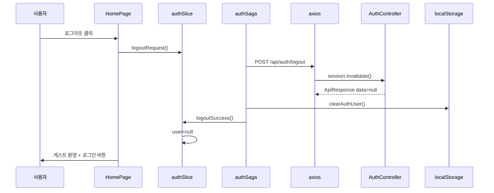

# 03. 로그아웃

HttpSession을 무효화하고, 프론트 Redux·localStorage 상태를 초기화하는 흐름입니다.

**문서 순서:** [00 공통](./00-common-infrastructure.md) · [01 로그인](./01-login.md) · [02 세션](./02-session-check.md) · **03 로그아웃** · [04 홈](./04-home.md) · [05 사이드바](./05-sidebar.md) · [06 목록](./06-staff-list.md) · [07 상세](./07-staff-detail.md) · [08 삭제](./08-staff-delete.md) · [09 등록](./09-staff-register.md) · [10 사진](./10-photo-upload.md) · [11 주소](./11-address-search.md) · [목록](./README.md)

---

## 관련 파일

### Frontend

| 파일 | 역할 |
|------|------|
| `app/page.tsx` | "로그아웃" 버튼 → `logoutRequest()` |
| `features/auth/slice/authSlice.ts` | `logoutRequest`, `logoutSuccess` |
| `features/auth/saga/authSaga.ts` | `logoutSaga` |
| `features/auth/api/authApi.ts` | `logoutApi` |
| `features/auth/utils/authStorage.ts` | `clearAuthUser` |

### Backend

| 파일 | 역할 |
|------|------|
| `AuthController.java` | `POST /api/auth/logout` |
| `LoginCheckInterceptor` | 제외 (세션 없어도 호출 가능) |

---

## 데이터 구조

로그아웃은 **요청 body 없음**, **응답 data = null**.

### Redux 변경

| 액션 | 변경 |
|------|------|
| `logoutRequest` | `loginLoading = true` |
| `logoutSuccess` | `user = null`, `loginLoading = false`, `sessionChecked = true`, 모달 닫힘 |

---

## 전체 흐름



---

## 단계별 상세

### Step 1 — UI (`app/page.tsx`)

```typescript
{user ? (
  <>
    <p>{user.name} ({user.staffId}) 님, 환영합니다.</p>
    <button onClick={() => dispatch(logoutRequest())}>로그아웃</button>
  </>
) : ( ... )}
```

로그아웃 버튼은 **홈 페이지에만** 있습니다.

### Step 2 — API

```
POST /api/auth/logout
Cookie: JSESSIONID=...
```

**응답:**

```json
{
  "code": "SUCCESS",
  "message": "OK",
  "data": null
}
```

### Step 3 — 백엔드

```java
session.invalidate();  // LOGIN_USER + JSESSIONID 파기
return ApiResponse.success(null);
```

### Step 4 — Saga (`logoutSaga`)

```typescript
try {
  yield call(logoutApi);  // 실패해도 catch에서 무시
} finally {
  clearAuthUser();       // localStorage 항상 삭제
  yield put(logoutSuccess());
}
```

서버 오류(이미 만료된 세션 등)가 나도 **프론트 상태는 반드시 초기화**합니다.

---

## 로그아웃 후 동작

| 위치 | 동작 |
|------|------|
| 홈 | 게스트 메시지 + "로그인" 버튼 |
| 사이드바 | 메뉴는 보이지만 클릭 시 LoginModal |
| `/staff` 등 보호 페이지 | RequireAuth → LoginModal |
| 이후 API 호출 | JSESSIONID 무효 → 401 UNAUTHORIZED |

---

## 설명 포인트

1. 로그아웃 = **서버 세션 invalidate + 클라이언트 상태 clear** 2단계
2. Saga `finally`로 **서버 실패해도 프론트는 로그아웃 처리**
3. `sessionChecked`는 `true` 유지 — "확인 중" 상태로 돌아가지 않음
4. 로그아웃 UI 진입점은 현재 **홈 페이지만**
