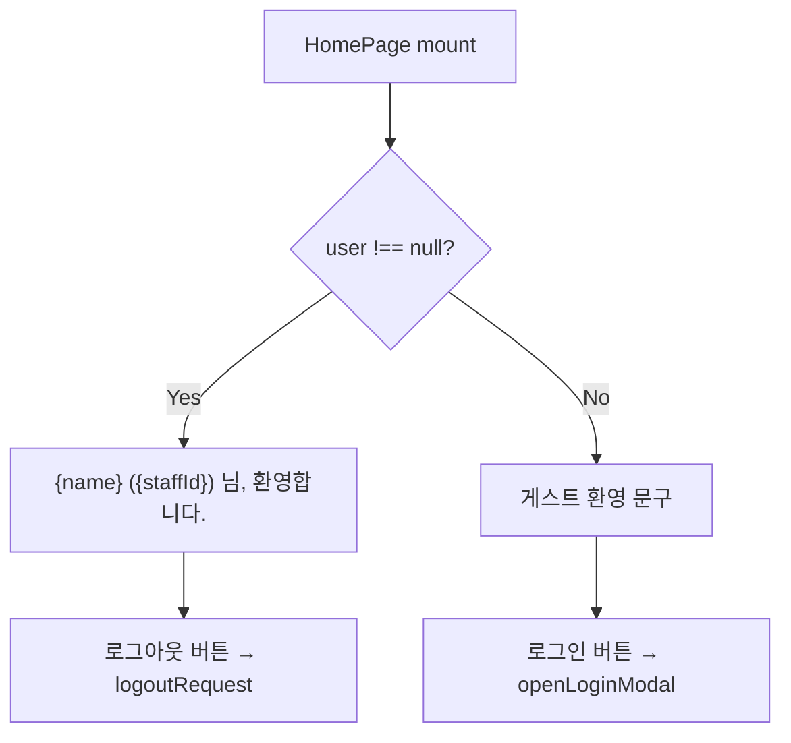

# 04. 홈 페이지

루트 경로(`/`)에서 로그인 상태에 따라 환영 메시지 또는 로그인 유도 UI를 표시합니다.  
별도 API 호출 없이 **Redux `auth.user`** 만 읽습니다.

**문서 순서:** [00 공통](./00-common-infrastructure.md) · [01 로그인](./01-login.md) · [02 세션](./02-session-check.md) · [03 로그아웃](./03-logout.md) · **04 홈** · [05 사이드바](./05-sidebar.md) · [06 목록](./06-staff-list.md) · [07 상세](./07-staff-detail.md) · [08 삭제](./08-staff-delete.md) · [09 등록](./09-staff-register.md) · [10 사진](./10-photo-upload.md) · [11 주소](./11-address-search.md) · [목록](./README.md)

---

## 관련 파일

| 파일 | 역할 |
|------|------|
| `app/page.tsx` | 홈 UI (Client Component) |
| `features/auth/slice/authSlice.ts` | `user` 읽기, `logoutRequest`, `openLoginModal` 디스패치 |

---

## 데이터 구조

### 읽는 Redux 상태

| 필드 | 타입 | 용도 |
|------|------|------|
| `user` | `AuthUser \| null` | 로그인 여부 분기 |

`AuthUser`:

| 필드 | 타입 |
|------|------|
| `staffId` | `string` |
| `name` | `string` |
| `staffRoleCode` | `string` |

### 디스패치하는 액션

| 액션 | 조건 |
|------|------|
| `logoutRequest()` | `user !== null` |
| `openLoginModal({ message: "로그인이 필요합니다." })` | `user === null` |

---

## UI 분기



---

## 코드 구조 (`app/page.tsx`)

```typescript
const { user } = useSelector((state: RootState) => state.auth);

return (
  <section>
    <h1>Home</h1>
    {user ? (
      // 로그인: 이름 + 로그아웃
    ) : (
      // 게스트: 안내 + 로그인 버튼
    )}
  </section>
);
```

---

## 선행 조건

홈 페이지 자체는 `RequireAuth`로 감싸지 **않습니다**.  
누구나 접근 가능하며, `user` 값은 **AppShell의 fetchMe**가 채웁니다.

```
layout.tsx → AppShell (fetchMe) → page.tsx (user 읽기)
```

---

## 다른 기능과의 연결

| 연결 | 설명 |
|------|------|
| → 로그인 | "로그인" 버튼 → LoginModal → [01-login.md](./01-login.md) |
| → 로그아웃 | "로그아웃" 버튼 → [03-logout.md](./03-logout.md) |
| ← 세션 확인 | `user`는 fetchMe 결과 → [02-session-check.md](./02-session-check.md) |
| ← 사이드바 | AppShell에서 Sidebar 항상 표시 → [05-sidebar.md](./05-sidebar.md) |

---

## 설명 포인트

1. 홈은 **인증 가드 없음** — 미로그인도 접근 가능
2. **API 호출 없음** — Redux 상태만 소비
3. 로그인/로그아웃 **진입점** 역할
4. `staffRoleCode`는 홈에서 표시하지 않지만 Redux에 존재
