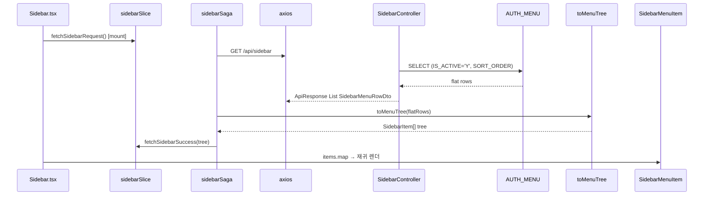
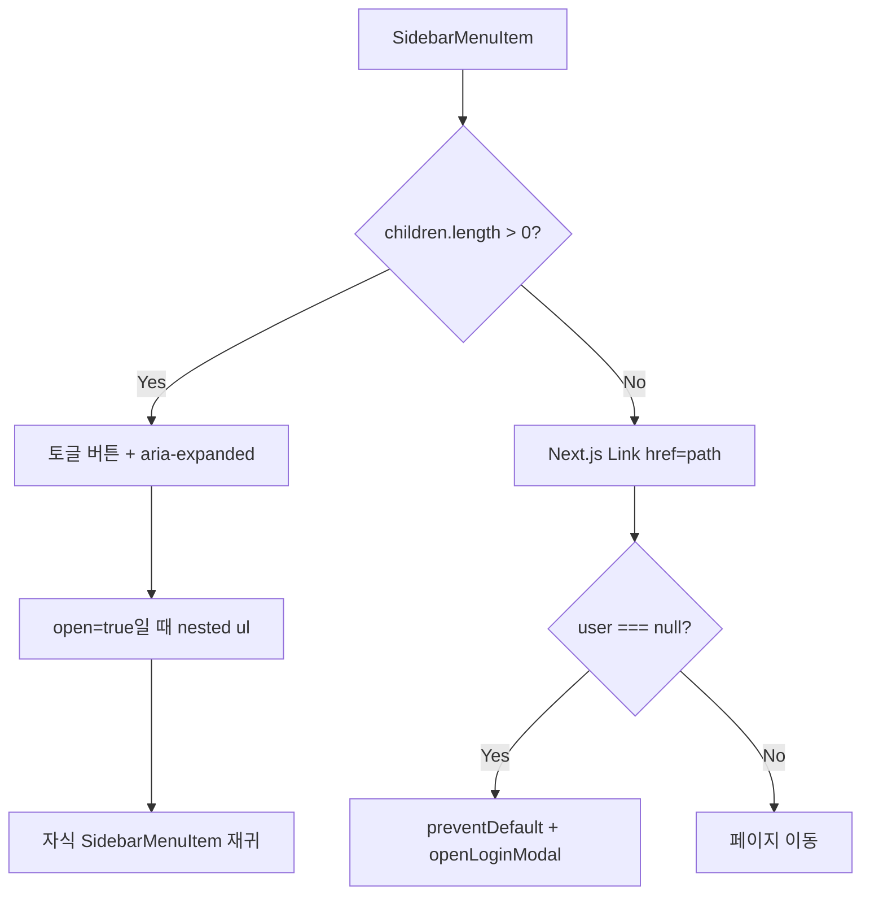

# 05. 사이드바 렌더링

백엔드 flat 메뉴 배열을 프론트에서 트리로 변환해, 재귀 컴포넌트로 렌더링하는 흐름입니다.

**문서 순서:** [00 공통](./00-common-infrastructure.md) · [01 로그인](./01-login.md) · [02 세션](./02-session-check.md) · [03 로그아웃](./03-logout.md) · [04 홈](./04-home.md) · **05 사이드바** · [06 목록](./06-staff-list.md) · [07 상세](./07-staff-detail.md) · [08 삭제](./08-staff-delete.md) · [09 등록](./09-staff-register.md) · [10 사진](./10-photo-upload.md) · [11 주소](./11-address-search.md) · [목록](./README.md)

---

## 관련 파일

### Frontend

| 파일 | 역할 |
|------|------|
| `components/sidebar/sidebar.tsx` | API 호출, top-level 메뉴 렌더 |
| `components/sidebar/SidebarMenuItem.tsx` | 재귀: 부모 토글 / 자식 Link |
| `components/layout/AppShell.tsx` | Sidebar를 좌측 aside에 고정 |
| `features/sidebar/slice/sidebarSlice.ts` | items, loading, error |
| `features/sidebar/saga/sidebarSaga.ts` | `fetchSidebarSaga` |
| `features/sidebar/api/sidebarApi.ts` | `fetchSidebarApi` |
| `features/sidebar/utils/menuTree.ts` | `toMenuTree()` flat → tree |
| `features/sidebar/types/sidebarTypes.ts` | `SidebarMenuRow`, `SidebarItem` |

### Backend

| 파일 | 역할 |
|------|------|
| `SidebarController.java` | `GET /api/sidebar` |
| `SidebarServiceImpl.java` | MyBatis 호출 |
| `SidebarMapper.xml` | `HOSPITAL.AUTH_MENU` 조회 |
| `LoginCheckInterceptor` | **제외** (공개 API) |

---

## 데이터 구조

### API 응답 — flat row (`SidebarMenuRow`)

| 필드 | 타입 | DB 컬럼 |
|------|------|---------|
| `id` | `number` | MENU_ID |
| `parentId` | `number \| null` | PARENT_ID |
| `label` | `string` | NAME |
| `path` | `string \| null` | PATH |

### UI 트리 — `SidebarItem` (toMenuTree 변환 후)

| 필드 | 타입 | 설명 |
|------|------|------|
| `id` | `number` | 메뉴 ID |
| `label` | `string` | 표시 이름 |
| `path` | `string` | URL (부모는 `""`) |
| `children?` | `SidebarItem[]` | 하위 메뉴 |

### Redux `sidebar` 상태

| 필드 | 타입 |
|------|------|
| `items` | `SidebarItem[]` |
| `loading` | `boolean` |
| `error` | `string \| null` |

---

## 전체 흐름



---

## API 상세

```
GET /api/sidebar
인증: 불필요
```

**응답 예시:**

```json
{
  "code": "SUCCESS",
  "message": "OK",
  "data": [
    { "id": 1, "parentId": null, "label": "관리", "path": null },
    { "id": 2, "parentId": 1, "label": "직원", "path": "/staff" }
  ]
}
```

### 백엔드 SQL 조건

- `IS_ACTIVE = 'Y'`
- `ORDER BY SORT_ORDER`

---

## toMenuTree 변환 (`menuTree.ts`)

### 입력 (flat)

```json
[
  { "id": 1, "parentId": null, "label": "관리", "path": null },
  { "id": 2, "parentId": 1, "label": "직원", "path": "/staff" }
]
```

### 출력 (nested)

```json
[
  {
    "id": 1,
    "label": "관리",
    "path": "",
    "children": [
      { "id": 2, "label": "직원", "path": "/staff", "children": [] }
    ]
  }
]
```

### 알고리즘

1. **1단계**: 모든 row를 `menuById[id]`에 `{ ...row, path: row.path ?? "", children: [] }`로 등록
2. **2단계**: `parentId === null` → `topMenus`에 push, 아니면 `menuById[parentId].children`에 push
3. 잘못된 `parentId` → 해당 row는 트리에서 제외

---

## SidebarMenuItem 렌더 규칙



---

## UI 상태 분기 (`sidebar.tsx`)

| 조건 | 표시 |
|------|------|
| `loading === true` | "Sidebar loading..." |
| `error !== null` | "Sidebar error: {error}" |
| 성공 | `<ul>` + `SidebarMenuItem` 목록 |

---

## 설명 포인트

1. API는 **flat 배열**, UI는 **트리** — 변환은 프론트 `toMenuTree` 책임
2. 사이드바 API는 **로그인 없이** 호출 가능 (메뉴 구조는 공개)
3. **페이지 이동**은 Link이지만, 미로그인 시 클릭 차단 + LoginModal
4. 부모 메뉴 `path=null` → `path=""` → Link 대신 **토글 버튼** 렌더
