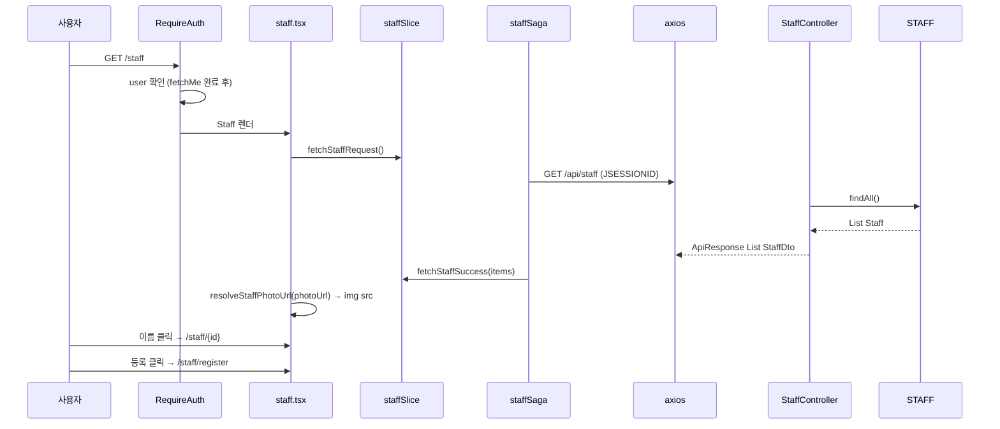

# 06. 직원 목록 (+ 목록 사진 표시)

로그인 후 `/staff`에서 전체 직원 목록을 테이블로 표시하고, 사진 URL을 img src로 렌더링합니다.

**문서 순서:** [00 공통](./00-common-infrastructure.md) · [01 로그인](./01-login.md) · [02 세션](./02-session-check.md) · [03 로그아웃](./03-logout.md) · [04 홈](./04-home.md) · [05 사이드바](./05-sidebar.md) · **06 목록** · [07 상세](./07-staff-detail.md) · [08 삭제](./08-staff-delete.md) · [09 등록](./09-staff-register.md) · [10 사진](./10-photo-upload.md) · [11 주소](./11-address-search.md) · [목록](./README.md)

---

## 관련 파일

### Frontend

| 파일 | 역할 |
|------|------|
| `app/staff/page.tsx` | RequireAuth + Staff |
| `components/staff/staff.tsx` | 목록 UI, 라우팅 |
| `features/staff/slice/staffSlice.ts` | items, loading, error |
| `features/staff/saga/staffSaga.ts` | `fetchStaffSaga` |
| `features/staff/api/staffApi.ts` | `fetchStaffList`, `resolveStaffPhotoUrl` |
| `features/staff/types/staffTypes.ts` | `StaffItem` |

### Backend

| 파일 | 역할 |
|------|------|
| `StaffController.java` | `GET /api/staff` |
| `StaffServiceImpl.java` | `findAll()` |
| `StaffMapper.java` | Entity → StaffDto, photoUrl 생성 |
| `LoginCheckInterceptor` | **세션 필요** (401) |

---

## 데이터 구조

### API 응답 — `StaffItem[]`

| 필드 | 타입 | DB/Entity 출처 |
|------|------|---------------|
| `id` | `string` | STAFF_ID |
| `name` | `string` | STAFF_NAME |
| `departmentName` | `string` | Department.name (FK) |
| `email` | `string` | STAFF_EMAIL |
| `photoUrl` | `string \| null` | staffPhotoKey 있으면 `"/api/staff/{id}/photo"` |

### Redux `staff` 상태 (목록)

| 필드 | 타입 |
|------|------|
| `items` | `StaffItem[]` |
| `loading` | `boolean` |
| `error` | `string \| null` |

---

## 전체 흐름



---

## API 상세

```
GET /api/staff
Cookie: JSESSIONID=... (필수)
```

**응답 예시:**

```json
{
  "code": "SUCCESS",
  "message": "OK",
  "data": [
    {
      "id": "E001",
      "name": "홍길동",
      "departmentName": "행정과",
      "email": "hong@hospital.com",
      "photoUrl": "/api/staff/E001/photo"
    },
    {
      "id": "E002",
      "name": "김간호",
      "departmentName": "간호부",
      "email": null,
      "photoUrl": null
    }
  ]
}
```

### 백엔드 photoUrl 생성 (StaffMapper)

```
staffPhotoKey가 비어있지 않으면 → photoUrl = "/api/staff/" + id + "/photo"
비어있으면 → photoUrl = null
```

---

## 목록 사진 표시

### resolveStaffPhotoUrl (`staffApi.ts`)

```typescript
function resolveStaffPhotoUrl(photoUrl: string | null | undefined): string | null {
  if (!photoUrl) return null;
  const apiBase = process.env.NEXT_PUBLIC_API_URL || "http://localhost:8081";
  return `${apiBase}${photoUrl}`;
}
```

### staff.tsx 렌더

```typescript
const photoSrc = resolveStaffPhotoUrl(staff.photoUrl);

{photoSrc ? (
  
) : (
  <span>-</span>
)}
```

### 사진 img 요청 흐름

```

  → 브라우저 GET (JSESSIONID 쿠키 포함)
  → StaffController.getStaffPhoto(id)
  → SeaweedFS download(staffPhotoKey)
  → ResponseEntity<byte[]> + Content-Type
```

**주의**: 사진 API는 `ApiResponse` 래퍼 없이 **바이너리** 반환.

---

## UI 동작

| 사용자 액션 | 결과 |
|------------|------|
| 페이지 진입 | `fetchStaffRequest` → 테이블 렌더 |
| 이름 클릭 | `router.push(`/staff/${id}`)` |
| 등록 버튼 | `router.push("/staff/register")` |
| loading | "직원 목록 불러오는 중..." |
| error | "직원 목록 오류: {error}" |

---

## 설명 포인트

1. 목록 API는 **세션 필수** — 미로그인 시 401
2. `photoUrl`은 SeaweedFS URL이 아니라 **백엔드 프록시 경로**
3. 프론트는 `NEXT_PUBLIC_API_URL` + 상대경로로 **절대 URL** 조합
4. `` 요청도 쿠키 전송 → 같은 origin이 아니므로 CORS + credentials 설정 필요
