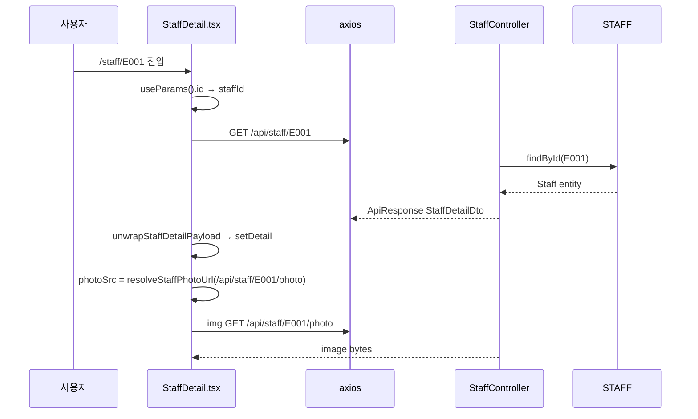

# 07. 직원 상세 (+ 상세 사진 표시)

`/staff/[id]`에서 한 직원의 상세 정보를 모달 형태로 표시합니다.  
**Redux Saga를 사용하지 않고** 컴포넌트 local state + 직접 API 호출합니다.

**문서 순서:** [00 공통](./00-common-infrastructure.md) · [01 로그인](./01-login.md) · [02 세션](./02-session-check.md) · [03 로그아웃](./03-logout.md) · [04 홈](./04-home.md) · [05 사이드바](./05-sidebar.md) · [06 목록](./06-staff-list.md) · **07 상세** · [08 삭제](./08-staff-delete.md) · [09 등록](./09-staff-register.md) · [10 사진](./10-photo-upload.md) · [11 주소](./11-address-search.md) · [목록](./README.md)

---

## 관련 파일

### Frontend

| 파일 | 역할 |
|------|------|
| `app/staff/[id]/page.tsx` | RequireAuth + StaffDetail |
| `components/staff/StaffDetail.tsx` | 상세 UI, 사진, 삭제 버튼 |
| `features/staff/api/staffApi.ts` | `fetchStaffDetail`, `resolveStaffPhotoUrl` |
| `features/staff/utils/detailResponse.ts` | `unwrapStaffDetailPayload`, `normalizeStaffDetailItem` |
| `features/staff/types/staffTypes.ts` | `StaffDetailItem` |

### Backend

| 파일 | 역할 |
|------|------|
| `StaffController.java` | `GET /api/staff/{id}`, `GET /api/staff/{id}/photo` |
| `StaffServiceImpl.java` | findById → StaffDetailDto |
| `LoginCheckInterceptor` | 세션 필요 |

---

## 데이터 구조

### API 응답 — `StaffDetailItem`

| 필드 | 타입 | DB 컬럼 | UI 섹션 |
|------|------|---------|---------|
| `id` | `string` | STAFF_ID | 기본 정보 (사번) |
| `name` | `string` | STAFF_NAME | 기본 + 사진 패널 |
| `departmentName` | `string` | FK | 기본 정보 |
| `staffType` | `string` | STAFF_TYPE | 근무 (DOC→의사, NUR→간호, ADM→행정) |
| `staffRankCode` | `string` | STAFF_RANK_CODE | 기본 (라벨: "면허번호") |
| `staffPositionCode` | `string \| null` | STAFF_POSITION_CODE | 근무 (직책) |
| `staffPhone` | `string` | STAFF_PHONE | 기본 |
| `staffExtensionNo` | `string \| null` | STAFF_EXTENSION_NO | 근무 (내선번호) |
| `email` | `string` | STAFF_EMAIL | 기본 |
| `hireDate` | `string` | STAFF_HIRE_DATE | 근무 (입사일) |
| `staffStatus` | `string` | STAFF_STATUS | 기본 (재직 상태) |
| `birthDate` | `string` | STAFF_BIRTH_DATE | 기본 |
| `address` | `string \| null` | STAFF_ADDRESS | 주소 정보 |

**응답에 없는 필드**: `password`, `photoUrl`, `staffPhotoKey`

### 컴포넌트 local state

| state | 타입 | 용도 |
|-------|------|------|
| `detail` | `StaffDetailItem \| null` | API 결과 |
| `detailLoading` | `boolean` | 로딩 |
| `detailError` | `string \| null` | 에러 |
| `photoFailed` | `boolean` | img onError 시 placeholder |

---

## 전체 흐름



---

## API 상세

```
GET /api/staff/{id}
Path param: id (String, STAFF_ID)
Cookie: JSESSIONID (필수)
```

**응답 예시:**

```json
{
  "code": "SUCCESS",
  "message": "OK",
  "data": {
    "id": "E001",
    "name": "홍길동",
    "departmentName": "행정과",
    "staffType": "ADM",
    "staffRankCode": "GEN",
    "staffPositionCode": null,
    "staffPhone": "010-1234-5678",
    "staffExtensionNo": null,
    "email": "hong@hospital.com",
    "hireDate": "2024-01-15",
    "staffStatus": "재직",
    "birthDate": "1990-05-20",
    "address": "06234 서울 강남구 테헤란로 123 4층"
  }
}
```

### 데이터 정규화 (`detailResponse.ts`)

```typescript
unwrapStaffDetailPayload(response.data)
  → response.data.data 추출
  → normalizeStaffDetailItem(raw)
  → null/undefined → "" 또는 null 변환
```

---

## 상세 사진 표시

목록과 달리 **API가 photoUrl을 주지 않음** → 프론트가 경로를 직접 조합:

```typescript
const photoSrc = resolveStaffPhotoUrl(`/api/staff/${detail.id}/photo`);
```

```typescript
{photoSrc && !photoFailed ? (
   setPhotoFailed(true)} />
) : (
  <AvatarPlaceholderIcon />
)}
```

| 상황 | 표시 |
|------|------|
| 사진 있음 + 로드 성공 | `` |
| 사진 없음 또는 onError | `AvatarPlaceholderIcon` |

---

## UI 섹션 매핑

### buildBasicFields

`id`, `name`, `departmentName`, `birthDate`, `email`, `staffPhone`, `staffRankCode`(면허번호), `staffStatus`

### buildWorkFields

`staffType`(한글 변환), `staffPositionCode`, `staffExtensionNo`, `hireDate`

### 주소 섹션

`detail.address` 단일 필드

---

## Redux와의 관계

| 항목 | 상태 |
|------|------|
| `fetchStaffDetailRequest` / `fetchStaffDetailSaga` | **정의만 있고 StaffDetail에서 미사용** |
| `staffSlice.detail` | **미사용** |
| 삭제 관련 state | `deletingId`, `deleteError`, `deletedStaffId` → [08-staff-delete.md](./08-staff-delete.md) |

---

## 설명 포인트

1. 상세 조회는 **local state + 직접 API** (Redux bypass)
2. 사진 URL은 **프론트가 규칙으로 생성** (`/api/staff/{id}/photo`)
3. `staffRankCode` UI 라벨은 "면허번호" (DB 컬럼명과 다름)
4. staffId 변경 시 `useEffect` cleanup으로 race condition 방지 (`cancelled` flag)
