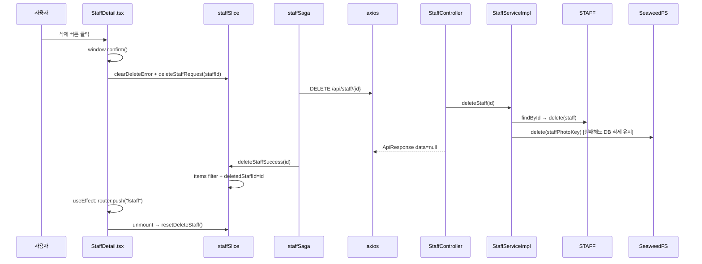

# 08. 직원 삭제

직원 상세 화면에서 확인 다이얼로그 후 DELETE API를 호출하고, 성공 시 목록으로 이동합니다.

**문서 순서:** [00 공통](./00-common-infrastructure.md) · [01 로그인](./01-login.md) · [02 세션](./02-session-check.md) · [03 로그아웃](./03-logout.md) · [04 홈](./04-home.md) · [05 사이드바](./05-sidebar.md) · [06 목록](./06-staff-list.md) · [07 상세](./07-staff-detail.md) · **08 삭제** · [09 등록](./09-staff-register.md) · [10 사진](./10-photo-upload.md) · [11 주소](./11-address-search.md) · [목록](./README.md)

---

## 관련 파일

### Frontend

| 파일 | 역할 |
|------|------|
| `components/staff/StaffDetail.tsx` | 삭제 버튼, confirm, `deleteStaffRequest` |
| `features/staff/slice/staffSlice.ts` | deletingId, deleteError, deletedStaffId |
| `features/staff/saga/staffSaga.ts` | `deleteStaffSaga` |
| `features/staff/api/staffApi.ts` | `deleteStaff` |

### Backend

| 파일 | 역할 |
|------|------|
| `StaffController.java` | `DELETE /api/staff/{id}` |
| `StaffServiceImpl.java` | DB 삭제 + SeaweedFS 삭제 |
| `SeaweedFsService.java` | `delete(staffPhotoKey)` |
| `LoginCheckInterceptor` | 세션 필요 |

---

## 데이터 구조

### 요청

```
DELETE /api/staff/{id}
Path param: id (String, STAFF_ID)
Body: 없음
Cookie: JSESSIONID (필수)
```

### 응답

```json
{
  "code": "SUCCESS",
  "message": "OK",
  "data": null
}
```

### Redux `staff` 상태 (삭제)

| 필드 | 타입 | 설명 |
|------|------|------|
| `deletingId` | `string \| null` | 삭제 진행 중인 ID |
| `deleteError` | `string \| null` | 삭제 실패 메시지 |
| `deletedStaffId` | `string \| null` | 삭제 성공한 ID |

### Redux 액션

| 액션 | payload | effect |
|------|---------|--------|
| `deleteStaffRequest` | `string` (id) | `deletingId=id`, error 초기화 |
| `deleteStaffSuccess` | `string` (id) | `deletingId=null`, `deletedStaffId=id`, **items에서 해당 id 제거** |
| `deleteStaffFailure` | `string` (message) | `deletingId=null`, `deleteError=message` |
| `clearDeleteError` | — | `deleteError=null` |
| `resetDeleteStaff` | — | 삭제 관련 필드 전부 초기화 |

---

## 전체 흐름



---

## 단계별 상세

### Step 1 — UI 확인 (`StaffDetail.tsx`)

```typescript
const confirmed = window.confirm(`"${detail.name}"(${detail.id}) 직원을 삭제하시겠습니까?`);
if (!confirmed) return;

dispatch(clearDeleteError());
dispatch(deleteStaffRequest(staffId));
```

버튼: `disabled={isDeleting}` → "삭제 중..." 표시

### Step 2 — Saga

```
deleteStaffRequest(id)
  → call(deleteStaff, id)
  → deleteStaffSuccess(id)
catch → deleteStaffFailure(message)
```

### Step 3 — 백엔드 Service

1. `staffRepository.findById(id)` — 없으면 `RuntimeException("staff Error")`
2. `staffPhotoKey` 저장
3. **`staffRepository.delete(staff)`** — DB 먼저 삭제
4. photoKey 있으면 `seaweedFsService.delete(key)` — **SeaweedFS 실패는 swallow** (DB 삭제는 유지)

### Step 4 — 성공 후 네비게이션

```typescript
useEffect(() => {
  if (deletedStaffId === staffId) {
    router.push("/staff");
  }
}, [deletedStaffId, staffId, router]);
```

### Step 5 — cleanup

```typescript
useEffect(() => {
  return () => { dispatch(resetDeleteStaff()); };
}, [dispatch]);
```

컴포넌트 unmount 시 삭제 state 초기화

---

## 부수 효과

`deleteStaffSuccess`는 Redux `staff.items`에서도 해당 id를 **filter**합니다.  
목록 페이지로 돌아갔을 때 삭제된 직원이 남아있지 않습니다 (재 fetch 없이).

---

## 에러 처리

| 상황 | HTTP | UI |
|------|------|-----|
| 존재하지 않는 id | 500 | `deleteError` alert |
| 세션 없음 | 401 | 인터셉터 |

```typescript
{deleteError && <div className="staff-detail__alert">삭제 오류: {deleteError}</div>}
```

---

## 설명 포인트

1. 삭제는 **Redux Saga** 사용 (상세 조회와 다름)
2. 백엔드: **DB 삭제 우선**, SeaweedFS 삭제 실패해도 롤백 안 함
3. `deletedStaffId` + `useEffect`로 **성공 시 자동 목록 이동**
4. `deleteStaffSuccess`가 **목록 state도 동기 갱신**
