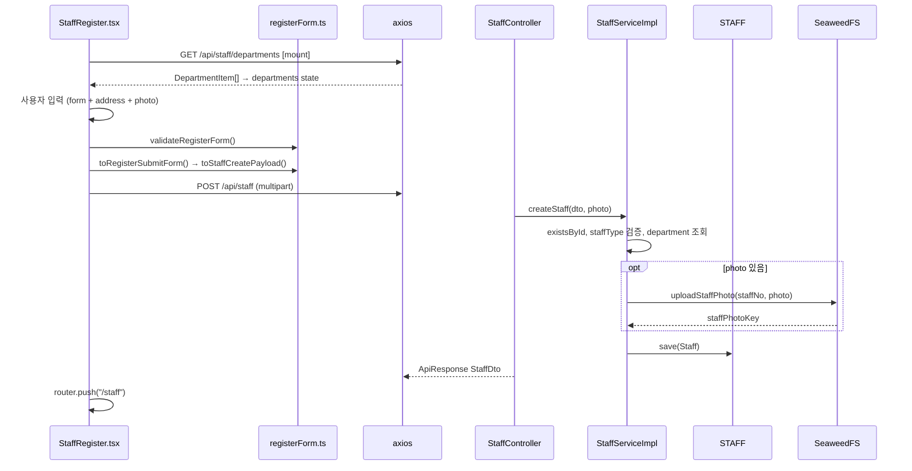

# 09. 직원 등록

`/staff/register`에서 신규 직원 정보를 입력하고 `POST /api/staff`로 등록합니다.  
**Redux 없이** 컴포넌트 local state + 직접 API 호출합니다.

**문서 순서:** [00 공통](./00-common-infrastructure.md) · [01 로그인](./01-login.md) · [02 세션](./02-session-check.md) · [03 로그아웃](./03-logout.md) · [04 홈](./04-home.md) · [05 사이드바](./05-sidebar.md) · [06 목록](./06-staff-list.md) · [07 상세](./07-staff-detail.md) · [08 삭제](./08-staff-delete.md) · **09 등록** · [10 사진](./10-photo-upload.md) · [11 주소](./11-address-search.md) · [목록](./README.md)

---

## 관련 파일

### Frontend

| 파일 | 역할 |
|------|------|
| `app/staff/register/page.tsx` | RequireAuth + StaffRegister |
| `components/staff/StaffRegister.tsx` | 등록 폼 UI |
| `features/staff/utils/registerForm.ts` | 검증, 변환, 에러 메시지 |
| `features/staff/api/staffApi.ts` | `fetchDepartmentList`, `createStaff` |
| `features/staff/types/staffTypes.ts` | StaffCreateForm, StaffCreateRequest, StaffCreatePayload |

### Backend

| 파일 | 역할 |
|------|------|
| `StaffController.java` | `POST /api/staff`, `GET /api/staff/departments` |
| `StaffServiceImpl.java` | createStaff, getDepartmentList |
| `StaffMapper.java` | DTO ↔ Entity |
| `DepartmentRepository` | 활성 부서 조회 |
| `SeaweedFsService.java` | photo 있으면 업로드 |
| `LoginCheckInterceptor` | 세션 필요 |

---

## 데이터 구조

### 폼 state — `StaffCreateForm`

| 필드 | 타입 | UI | 필수 |
|------|------|-----|------|
| `staffNo` | `string` | 사번 | ✅ |
| `password` | `string` | 비밀번호 | ✅ |
| `name` | `string` | 이름 | ✅ |
| `departmentId` | `string` | 부서 select | ✅ |
| `staffType` | `string` | hidden, 기본 `"ADM"` | — |
| `staffRankCode` | `string` | 면허번호 | 의사/간호만 (UI hint) |
| `staffPositionCode` | `string` | — | 항상 `""` 로 전송 |
| `staffPhone` | `string` | 휴대폰 | ✅ |
| `staffExtensionNo` | `string` | — | 항상 `""` 로 전송 |
| `email` | `string` | 이메일 | 선택 |
| `address` | `string` | — | 주소 폼에서 조합 |
| `hireDate` | `string` | — | 미입력 시 오늘 날짜 |
| `birthDate` | `string` | date input | ✅ |

### 주소 state — `RegisterAddressForm` (별도 state)

| 필드 | 타입 | 필수 |
|------|------|------|
| `zipCode` | `string` | ✅ |
| `baseAddress` | `string` | ✅ |
| `detailAddress` | `string` | 선택 |

### API 요청 — `StaffCreateRequest` (@RequestPart "staff")

백엔드 `StaffCreateRequestDto`와 **필드명 1:1**:

| 필드 | 타입 | 백엔드 처리 |
|------|------|------------|
| `staffNo` | `string` | STAFF_ID (PK) |
| `password` | `string` | STAFF_PASSWORD |
| `name` | `string` | STAFF_NAME |
| `departmentId` | `string` | FK STAFF_DEPARTMENT_ID |
| `staffType` | `string` | STAFF_TYPE (DOC/NUR/ADM) |
| `staffRankCode` | `string` | STAFF_RANK_CODE |
| `staffPositionCode` | `string` | blank → null |
| `staffPhone` | `string` | STAFF_PHONE |
| `staffExtensionNo` | `string` | blank → null |
| `email` | `string` | blank → null |
| `address` | `string` | blank → null |
| `hireDate` | `string` (ISO date) | STAFF_HIRE_DATE |
| `birthDate` | `string` (ISO date) | STAFF_BIRTH_DATE |

### 서버 자동 설정 (요청에 없음)

| 필드 | 값 |
|------|-----|
| `staffStatus` | `"재직"` |
| `staffRoleCode` | DOC→`ROLE_DOCTOR`, NUR→`ROLE_NURSE`, ADM→`ROLE_ADMIN` |
| `staffPhotoKey` | photo 업로드 시 SeaweedFS key |

### 부서 API — `DepartmentItem`

| 필드 | 타입 |
|------|------|
| `departmentId` | `string` |
| `departmentName` | `string` |

---

## 전체 흐름



---

## 부서 목록 API

```
GET /api/staff/departments
Cookie: JSESSIONID (필수)
```

**응답:**

```json
{
  "code": "SUCCESS",
  "message": "OK",
  "data": [
    { "departmentId": "D001", "departmentName": "행정과" },
    { "departmentId": "D002", "departmentName": "간호부" }
  ]
}
```

백엔드: `departmentRepository.findByIsActiveOrderById("Y")`

---

## 등록 API

```
POST /api/staff
Content-Type: multipart/form-data
Cookie: JSESSIONID (필수)

Parts:
  staff = Blob(application/json) → StaffCreateRequestDto
  photo = File (optional)
```

**성공 응답:**

```json
{
  "code": "SUCCESS",
  "message": "OK",
  "data": {
    "id": "E003",
    "name": "신규직원",
    "departmentName": "행정과",
    "email": "new@hospital.com",
    "photoUrl": "/api/staff/E003/photo"
  }
}
```

---

## 프론트 데이터 변환 파이프라인

```
StaffCreateForm (form state)
  + RegisterAddressForm (address state)
    ↓ validateRegisterForm() — 클라이언트 검증
    ↓ toRegisterSubmitForm(form, address):
        staffType ||= "ADM"
        staffRankCode = trim || "GEN"
        staffPositionCode = ""
        staffExtensionNo = ""
        hireDate ||= today (YYYY-MM-DD)
        address = buildStaffAddress(address)
          → "우편번호 기본주소 상세주소" (공백 join)
    ↓ toStaffCreatePayload(form, photo)
    ↓ createStaff(payload)
        FormData:
          staff = JSON Blob
          photo = File (optional)
```

### buildStaffAddress

```typescript
[zipCode, baseAddress, detailAddress]
  .map(trim).filter(Boolean).join(" ")
// 예: "06234 서울 강남구 테헤란로 123 4층"
```

---

## 백엔드 검증 (StaffServiceImpl.createStaff)

| 검증 | 실패 |
|------|------|
| staffNo 이미 존재 | `RuntimeException("staff Error")` → HTTP 500 |
| staffType ∉ {DOC, NUR, ADM} | 동일 |
| departmentId不存在 | 동일 |

---

## 클라이언트 검증 (validateRegisterForm)

| 조건 | 메시지 |
|------|--------|
| staffNo 빈값 | "사번을 입력해주세요." |
| password 빈값 | "비밀번호를 입력해주세요." |
| departmentId 없음 | "부서를 선택해주세요." |
| name 빈값 | "이름을 입력해주세요." |
| birthDate 없음 | "생년월일을 선택해주세요." |
| staffPhone 빈값 | "휴대폰번호를 입력해주세요." |
| zipCode 빈값 | "우편번호를 입력해주세요." |
| baseAddress 빈값 | "기본주소를 입력해주세요." |

---

## 에러 처리 (getStaffCreateErrorMessage)

| HTTP | 메시지 |
|------|--------|
| 400 | "등록 요청 형식이 올바르지 않습니다..." |
| 500 | "등록에 실패했습니다. 사번이 이미 사용 중인지..." |
| 기타 | response.data.message 또는 기본 메시지 |

---

## 설명 포인트

1. 등록은 **Redux bypass** — `submitting`, `formError` local state
2. `@RequestPart("staff")` = JSON Blob, `@RequestPart("photo")` = File (optional)
3. **Content-Type을 axios에 수동 지정하면 안 됨** — boundary 자동 설정 필요
4. UI에 없는 필드(`staffType`, `hireDate` 등)는 **코드에서 기본값 주입**
5. 직원 **수정(PUT/PATCH) API는 없음**
