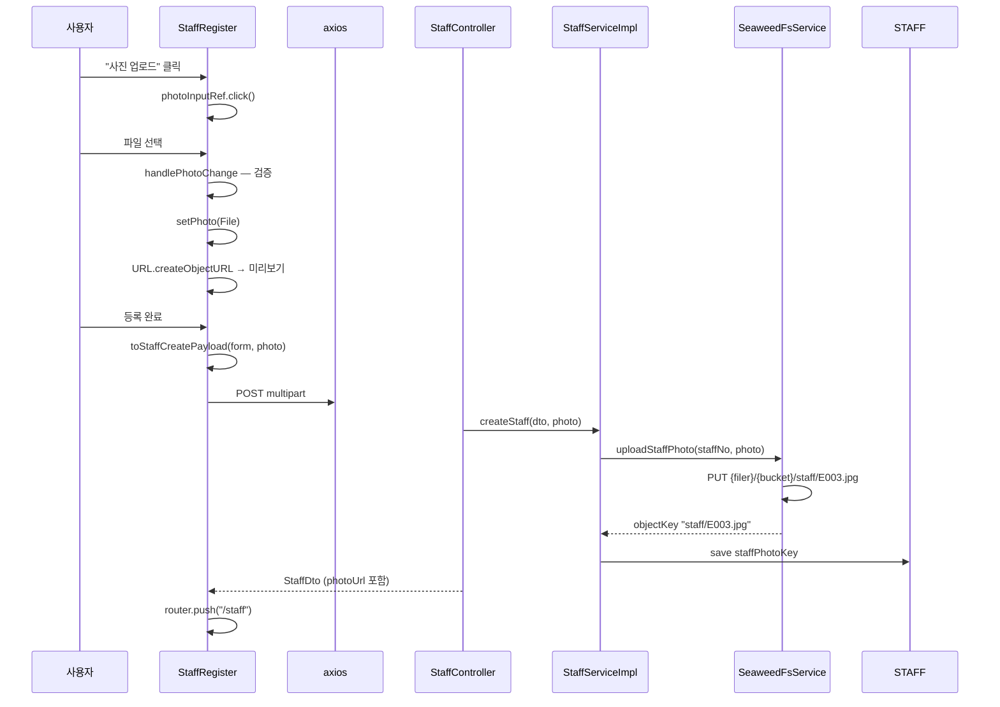

# 10. 등록 시 사진 첨부 (multipart)

직원 등록 폼에서 이미지 파일을 선택하고, `POST /api/staff` multipart의 `photo` part로 전송하는 흐름입니다.  
[09-staff-register.md](./09-staff-register.md)의 하위 기능이지만, **저장·검증·표시**를 프론트·백엔드·SeaweedFS까지 분리해 설명합니다.

**문서 순서:** [00 공통](./00-common-infrastructure.md) · [01 로그인](./01-login.md) · [02 세션](./02-session-check.md) · [03 로그아웃](./03-logout.md) · [04 홈](./04-home.md) · [05 사이드바](./05-sidebar.md) · [06 목록](./06-staff-list.md) · [07 상세](./07-staff-detail.md) · [08 삭제](./08-staff-delete.md) · [09 등록](./09-staff-register.md) · **10 사진** · [11 주소](./11-address-search.md) · [목록](./README.md)

---

## 관련 파일

### Frontend

| 파일 | 역할 |
|------|------|
| `components/staff/StaffRegister.tsx` | file input, preview, validation |
| `features/staff/api/staffApi.ts` | `createStaff` FormData 구성 |
| `features/staff/utils/registerForm.ts` | `toStaffCreatePayload(form, photo)` |
| `icons/UploadIcon.tsx`, `AvatarPlaceholderIcon.tsx` | UI |

### Backend

| 파일 | 역할 |
|------|------|
| `StaffController.java` | `@RequestPart("photo") MultipartFile` |
| `StaffServiceImpl.java` | photo non-empty → upload |
| `SeaweedFsService.java` | uploadStaffPhoto, download, delete |
| `Staff` entity | `staffPhotoKey` → STAFF_PHOTO_KEY |

---

## 데이터 구조

### 프론트 local state

| state | 타입 | 설명 |
|-------|------|------|
| `photo` | `File \| null` | 선택된 파일 |
| `photoPreviewUrl` | `string \| null` | `URL.createObjectURL` 미리보기 |
| `photoInputRef` | `RefObject<HTMLInputElement>` | hidden file input |

### multipart 요청 구조

```
POST /api/staff
Content-Type: multipart/form-data; boundary=----...

------boundary
Content-Disposition: form-data; name="staff"
Content-Type: application/json

{"staffNo":"E003","password":"1234","name":"신규",...}
------boundary
Content-Disposition: form-data; name="photo"; filename="profile.jpg"
Content-Type: image/jpeg

<binary data>
------boundary--
```

| Part name | 타입 | 필수 |
|-----------|------|------|
| `staff` | JSON (`StaffCreateRequestDto`) | ✅ |
| `photo` | `MultipartFile` | ❌ optional |

### DB 저장

| 컬럼 | 값 예시 |
|------|---------|
| STAFF_PHOTO_KEY | `staff/E003.jpg` |

목록 API `photoUrl`: `"/api/staff/E003/photo"` (key 있을 때만)

---

## 전체 흐름



---

## 프론트 — 파일 선택 (`handlePhotoChange`)

```typescript
const file = event.target.files?.[0];
```

### 클라이언트 검증

| 규칙 | 에러 메시지 |
|------|------------|
| `!file.type.startsWith("image/")` | "이미지 파일만 첨부할 수 있습니다." |
| `file.size > 5 * 1024 * 1024` | "사진은 5MB 이하만 첨부할 수 있습니다." |
| HTML accept | `image/jpeg,image/png,image/gif,image/webp` |

검증 실패 시: `event.target.value = ""`, `setPhoto(null)`

### 미리보기

```typescript
useEffect(() => {
  if (!photo) { setPhotoPreviewUrl(null); return; }
  const previewUrl = URL.createObjectURL(photo);
  setPhotoPreviewUrl(previewUrl);
  return () => URL.revokeObjectURL(previewUrl);  // 메모리 해제
}, [photo]);
```

미리보기는 **로컬 blob URL** — 서버 요청 없음.

---

## 프론트 — FormData 구성 (`createStaff`)

```typescript
const formData = new FormData();
formData.append(
  "staff",
  new Blob([JSON.stringify(staffRequest)], { type: "application/json" })
);
if (photo) {
  formData.append("photo", photo);
}
await api.post("/api/staff", formData);
// Content-Type 헤더 수동 설정 금지!
```

---

## 백엔드 — SeaweedFsService.uploadStaffPhoto

| 규칙 | 값 |
|------|-----|
| 최대 크기 | 5 MB |
| 허용 MIME | image/jpeg, image/png, image/gif, image/webp |
| 객체 키 | `"staff/" + staffId + extension` |
| 업로드 | HTTP PUT → `{filerEndpoint}/{bucket}/{objectKey}` |
| bucket | `emp_photo` (application.yml) |

### photo 없이 등록

- `staffPhotoKey = null`
- 응답 `photoUrl = null`
- 목록/상세에서 placeholder 표시

---

## 등록 후 사진 조회 (연계)

| 화면 | URL 출처 |
|------|---------|
| 목록 | API `photoUrl` → `resolveStaffPhotoUrl` |
| 상세 | `/api/staff/{id}/photo` 직접 조합 |
| 등록 미리보기 | blob URL (로컬) |

```
GET /api/staff/E003/photo
  → Staff.staffPhotoKey 조회
  → SeaweedFsService.download(key)
  → ResponseEntity<byte[]> (ApiResponse 아님)
```

---

## 삭제 시 사진 처리 (연계)

[08-staff-delete.md](./08-staff-delete.md):

1. DB에서 Staff 삭제
2. `staffPhotoKey`로 SeaweedFS delete (실패해도 DB 삭제 유지)

---

## 설명 포인트

1. `photo`는 **Redux를 거치지 않음** — File 객체는 store에 넣을 수 없음
2. multipart = **2개 part**: JSON `staff` + binary `photo`
3. DB에는 **URL이 아니라 SeaweedFS object key** 저장
4. 클라이언트·서버 **양쪽 5MB + image/* 검증**
5. 사진 API만 **바이너리 응답** (JSON wrapper 없음)
