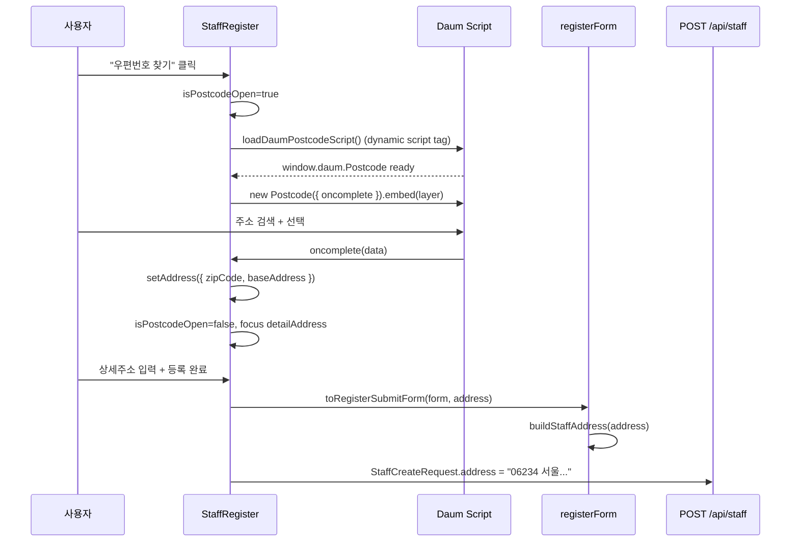

# 11. 등록 시 주소 검색 (다음 우편번호)

직원 등록 폼에서 Daum Postcode API로 우편번호·기본주소를 자동 입력하고, 최종적으로 하나의 `address` 문자열로 백엔드에 전송하는 흐름입니다.

**문서 순서:** [00 공통](./00-common-infrastructure.md) · [01 로그인](./01-login.md) · [02 세션](./02-session-check.md) · [03 로그아웃](./03-logout.md) · [04 홈](./04-home.md) · [05 사이드바](./05-sidebar.md) · [06 목록](./06-staff-list.md) · [07 상세](./07-staff-detail.md) · [08 삭제](./08-staff-delete.md) · [09 등록](./09-staff-register.md) · [10 사진](./10-photo-upload.md) · **11 주소** · [목록](./README.md)

---

## 관련 파일

### Frontend

| 파일 | 역할 |
|------|------|
| `components/staff/StaffRegister.tsx` | 스크립트 로드, 모달, embed, oncomplete |
| `features/staff/utils/registerForm.ts` | `buildStaffAddress`, `RegisterAddressForm` |

### External

| 항목 | 값 |
|------|-----|
| 스크립트 URL | `https://t1.daumcdn.net/mapjsapi/bundle/postcode/prod/postcode.v2.js` |
| API | `window.daum.Postcode` |

### Backend

주소 검색 자체는 **외부 API** — 백엔드는 최종 `address` 문자열만 받음:

| 필드 | DB 컬럼 |
|------|---------|
| `address` (String) | STAFF_ADDRESS |

---

## 데이터 구조

### 주소 폼 state — `RegisterAddressForm`

| 필드 | 타입 | UI | 필수 |
|------|------|-----|------|
| `zipCode` | `string` | 우편번호 input | ✅ |
| `baseAddress` | `string` | 기본주소 input | ✅ |
| `detailAddress` | `string` | 상세주소 input | 선택 |

초기값 (`REGISTER_ADDRESS_INITIAL`): 모두 `""`

### Daum Postcode 콜백 데이터

```typescript
type DaumPostcodeData = {
  zonecode: string;        // 우편번호
  roadAddress: string;     // 도로명 주소
  jibunAddress: string;    // 지번 주소
  userSelectedType: "R" | "J";  // R=도로명, J=지번
};
```

### 컴포넌트 추가 state

| state | 타입 | 용도 |
|-------|------|------|
| `isPostcodeOpen` | `boolean` | 우편번호 모달 표시 |
| `postcodeLoadFailed` | `boolean` | 스크립트 로드 실패 |
| `postcodeLayerRef` | `RefObject<HTMLDivElement>` | Postcode embed 대상 |

### 최종 API 전송값

```typescript
buildStaffAddress(address)
  → [zipCode, baseAddress, detailAddress].map(trim).filter(Boolean).join(" ")
```

**예시:**

```
입력: zipCode="06234", baseAddress="서울 강남구 테헤란로 123", detailAddress="4층"
출력: "06234 서울 강남구 테헤란로 123 4층"
  → StaffCreateRequest.address
  → DB STAFF_ADDRESS
```

---

## 전체 흐름



---

## 단계별 상세

### Step 1 — 모달 열기

```typescript
onClick={() => {
  setFormError(null);
  setPostcodeLoadFailed(false);
  setIsPostcodeOpen(true);
}}
```

### Step 2 — 스크립트 동적 로드 (`loadDaumPostcodeScript`)

```typescript
if (window.daum?.Postcode) return Promise.resolve();

const script = document.createElement("script");
script.src = DAUM_POSTCODE_SCRIPT_URL;
script.async = true;
document.head.appendChild(script);
```

- 이미 로드됐으면 재로드 안 함
- `onerror` → `postcodeLoadFailed=true`

### Step 3 — Postcode embed

```typescript
new window.daum.Postcode({
  oncomplete: (data) => {
    const selectedAddress =
      data.userSelectedType === "R" ? data.roadAddress : data.jibunAddress;

    setAddress((prev) => ({
      ...prev,
      zipCode: data.zonecode,
      baseAddress: selectedAddress,
    }));
    setIsPostcodeOpen(false);
    setTimeout(() => document.getElementById("detailAddress")?.focus(), 0);
  },
  onclose: () => setIsPostcodeOpen(false),
  width: "100%",
  height: "100%",
}).embed(postcodeLayerRef.current);
```

### Step 4 — 수동 입력도 가능

우편번호·기본주소 input은 **직접 타이핑** 가능 (Postcode 없이).  
`validateRegisterForm`에서 zipCode, baseAddress 필수 검증.

### Step 5 — 등록 시 address 조합

[09-staff-register.md](./09-staff-register.md)의 `toRegisterSubmitForm` → `buildStaffAddress`

---

## UI 구조

```
[주소 정보 섹션]
  우편번호 input + [우편번호 찾기] 버튼
  기본주소 input
  상세주소 input (선택)

[우편번호 모달] (isPostcodeOpen)
  overlay → dialog
    header: "우편번호 검색"
    body: postcodeLayerRef (Daum embed)
    또는 postcodeLoadFailed → 에러 메시지
```

---

## 백엔드 처리

`StaffCreateRequestDto.address`:
- blank → `null` (DB STAFF_ADDRESS nullable)
- 값 있으면 그대로 `Staff.address` 저장

상세 API `GET /api/staff/{id}` → `address` 필드로 반환  
상세 UI 주소 섹션에 단일 문자열 표시.

---

## Redux / API / localStorage

| 항목 | 사용 |
|------|------|
| Redux | ❌ |
| 백엔드 API (주소 검색) | ❌ (Daum 외부) |
| localStorage | ❌ |

주소 검색은 **100% 프론트 + Daum CDN** — 등록 submit 시에만 백엔드로 `address` 문자열 전달.

---

## cleanup

```typescript
useEffect(() => {
  // isPostcodeOpen 변경 시
  return () => {
    cancelled = true;
    postcodeLayerRef.current.innerHTML = "";  // embed DOM 정리
  };
}, [isPostcodeOpen]);
```

---

## 설명 포인트

1. Daum Postcode는 **외부 CDN 스크립트** — npm 패키지 아님
2. `RegisterAddressForm`(3필드) → `buildStaffAddress` → **단일 문자열**로 API 전송
3. 도로명/지번 선택은 `userSelectedType`으로 분기
4. 우편번호 모달 닫힌 후 **상세주소 input에 focus** 이동
5. 백엔드는 우편번호·기본·상세를 **분리 저장하지 않음** — 하나의 address 컬럼
